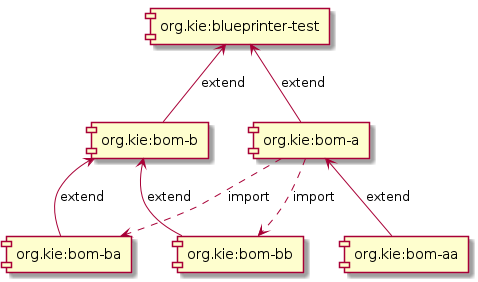

KIE Blueprinter Maven Plugin
============================

Scope of this plugin is to implement print overall maven project architecture in UML-like style using PlantUML syntax.

Example of generated diagram



Requirements
------------
The plugin requires Dot/Graphviz to be installed on the machine


Usage
-----

1. Include the plugin in the project' pom
```xml
  <build>
    <plugins>
      <plugin>
        <groupId>org.kie</groupId>
        <artifactId>blueprinter-maven-plugin</artifactId>
        <version>1.0</version>
      </plugin>
    </plugins>
  </build>
```
2. invoke it with 
```shell
mvn blueprinter:print
```